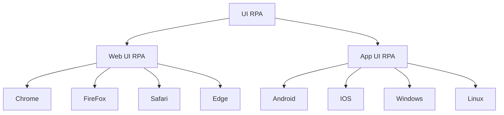
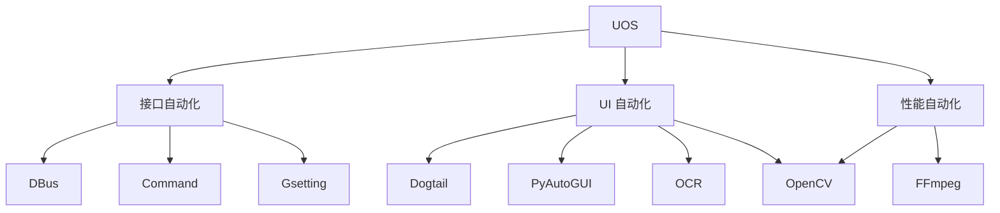

# RPA测试

## RPA是什么

RPA（Robotic Process Automation 机器人流程自动化）是一种技术理念，其核心是将一些人工重复性的任务使用自动化的手段来执行。可以提高企业的运行效率，降低人工投入。

RPA 是一个很泛的概念，一句话讲清楚就是：`把一切能手工执行的任务交给自动化来执行`。至于具体使用哪种自动化技术，我只能说不确定，因为这是需要 `因需制宜` 的。

在 RPA 这个概念提出来之前（大概是90年代），财务人员能使用 Excel 进行财务计算，就已经是在践行 RPA 了，毕竟以前都是用算盘在做，稍微先进点的用直呼归零的计算器，不仅需要投入大量的人力，而且还容易出错，Excel 里面的公式能自动处理大量的数据，工作效率是一个飞跃，再到后来出现财务管理软件出现，又在 Excel 的基础上进一步提高的自动化程度。

你看，在不同的时期，RPA 技术用到的具体技术或工具是不同的，在不同的行业也是这样，文案工作者从最开始一个本子一支笔，再到用 Word，再到用 GPT 自动生成。

所以说，`RPA 是一种技术理念，一种将一切行为自动化的理念`，凡是可以替代人工的技术或工具，都可以称之为 RPA 技术。

## RPA测试的由来

前面咱们理清了 RPA 核心就是自动化，那 RPA 测试也就是自动化测试，这节我来简单的介绍下自动化测试的由来；

软件测试行业在刚开始的时候，所有的测试人员都是手工测试；

互联网行业飞速发展，快速迭代发布，主打的就是一个快；这个时候有测试小伙伴就想了，每次迭代都讲测试时间不够、人力不够、睡眠不够，这么搞谁顶得住；

这时候机智的测试小伙伴就想到了，每次迭代都是那些活，这些事情能不能自动化来执行，我在旁边喝咖啡就行了，于是直接上网冲浪一看，还真有技术能做这些活；

要想替代人工测试，最直接最容易想到的就是替代人工做点击输入类的动作，这类称为 **UI 自动化测试**，UI 自动化测试是最接近于真实用户的自动化测试类型，早期的自动化测试工具如：QTP、Selenium等很快流行起来；

但自动化测试项目稍微一落地运行就会发现，太难维护了，前端功能界面一天变三回，人都麻了；

找开发稍微一合计，既然是前后端分离的系统，只管后端接口的输入输出正常岂不方便许多，又上网冲浪找到一个 Requests 的库能做接口请求，于是开始搞**接口自动化测试**了，发现投入产出比挺高，效果还可以，靠着口口相传，测试圈内刮起了一股浩浩荡荡的接口自动化测试风潮。

在接口自动化测试基础上又衍生出了**性能自动化**，因为高并发的场景如果靠人工来测试几乎是不可能的，而利用多线程并发做接口请求可以轻松做到。

## RPA测试技术

自动化测试始终是贯穿于软件开发过程周期的，在不同的阶段介入，做不同的自动化测试：

### 开发阶段

这个阶段开发还在疯狂的新增和修改代码，适合做的只有**单元测试自动化**；

圈内有个很有名的黑话叫**测试驱动开发**（TDD，Test Driven Development），说的是在编写某个功能代码之前要求先编写测试代码，这里的测试代码实际指的是单元测试代码。据观察，测试同学写应用单元测试代码的情况，还比较少的，这里面主要有学习、沟通成本等问题。

单元测试往往是由开发同学自己写，在国内这个情况是比较普遍的，因此这里就不过多描述。

### 集成交付阶段

到这个阶段说明开发至少交付了一个版本，但是又还没有稳定下来，各功能、界面等等还有可能会改动，因此这个阶段适合做**接口自动化**。

无论是从业务上还是技术上讲，接口自动化都属于是比较容易开展起来的自动化类型；

业务上，互联网行业都在流行微服务架构，服务端接口小修小补很正常，无非是些参数的增删改，整个接口大改还是少有的，毕竟前期经过了多轮次评审，因此后端服务接口是相对稳定的；

技术上，自动化测试只要有一个能做接口请求的工具，就可以开展起来，这类工具以 Requests 、Postman为代表，且不论自动化工程化等方面，使用 `unittest + requests` 能做接口请求，能组织用例跑起来，就能快速的把接口自动化开展起来。

因此，业务接口稳定，技术门槛低，接口自动化很自然的就能很顺利的落地。

#### 最流行的接口自动化组合套装

`Pytest + Requests + Allure`

- Pytest 用于驱动用例批量执行；如果对测试用例过程管控没有太多需求，使用 unittest 足矣；
- Requests 用于做接口请求；
- Allure 用于生成测试报告；如果对测试报告UI效果要求不高，不用 Allure 也行，Pytest 或 unittest 驱动用例跑完之后终端也会有简易的结果展示；

此技术路线是比较通用的，当然不同的人使用这些工具做出来的效果也是不同的，需要有一些框架设计，这里不做赘述；

#### 一条龙的工具

`HttpRunner`

实际上也是基于 `用例驱动工具 + 接口请求工具 + 测试报告工具` 进行封装，以框架级服务提供功能，让使用者能专注于接口用例的维护，而不用关心其他的。

-----------------

此外，**性能自动化测试**也开始在这一阶段介入，常用的性能测试工具：JMeter、Locust；

### 验收维护阶段

此阶段系统各方面功能已经趋于稳定，适合做 **UI 自动化**。

UI 自动化是从功能的层面模拟手工操作进行自动化测试，核心内容是 `元素定位` 和 `元素操作` ，看起来很简单对吧，但实际上 UI 自动化是所有自动化测试类型中最难的。

为什么这么说？

UI 自动化是从用户视角进行自动化测试，测试的对象是客户端，而客户端有分布在不同的平台设备上；

#### Web

Web UI 自动化就是基于浏览器的 UI 自动化测试；不同的浏览器用到的底层驱动是不同的，但由于一些自动化工具封装了统一的API接口（如 Playwright），在编码上并没有特别大的区别。

难点在于网速、浏览器、脚本的健壮性和测试环境等因素都会导致UI自动化测试的失败，产品迭代的过程中维护性差，维护成本高。

常用到的工具：Selenium、Playwright、Cypress、Puppeteer、TestCafe；

#### App

App UI 自动化可能涉及到多平台设备，如 Android、IOS、Windows、Linux，不同的平台设备上用到的自动化测试工具是不同的，下面简单的列举一些：

- Android 自动化测试：Appium、UIAutomator、UIAutomator2；
- IOS 自动化测试：XCUITest、Appium、facebook-wda；
- Windows 自动化测试：UIautomation、WinAppDriver；
- Linux 自动化测试：Dogtail、LDTP；

可以看到，App UI 自动化涉及的工具多，学习门槛高，且相比于 Web UI 自动化维护难度翻倍；

## 统信RPA测试应用

统信的主要产品是基于 Linux 的操作系统。

首先，操作系统提供了一些 DBus 接口、Gsetting 接口、命令行接口等，能做**接口自动化测试**；然后，操作系统桌面 App 也可以做 **UI 自动化** 和 **性能自动化**。

列举一些主要用到的技术：

### 

